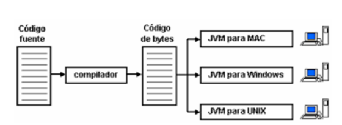

# Java

Java es, además de un lenguaje de programación, toda un ecosistema de frameworks y software desarrollado por James Gosling en los años 90 (la primera versión es de 1996). El lenguaje Java pone su énfasis en la programación orientada a objetos, siendo estrictamente basado en clases. Se basa en C++ (que era probablemente el lenguaje de programación de propósito general más popular antes de Java), eliminando la herencia múltiple para utilizar las jerarquías de clases para ordenar librerías de un modo jerárquico.

Java es un lenguaje que se compila a **bytecode**, un código intermedio que se interpreta en la JVM para garantizar una gran portabilidad. El mismo bytecode puede ser ejecutado en distintas máquinas sobre su JVM correspondiente.

Los fuente de Java están organizados en clases que se almacenan en ficheros .java. Estos deben ser compilados para crear los ficheros objeto de la JVM. Cuando se compila un fichero fuente .java se generan uno o varios archivos .class, uno por cada clase que tenga el fichero. Estos ficheros contienen el bytecode.

Las principales partes a diferenciar de Java son:

1. Java Virtual Machine (JVM):  
    La máquina virtual java ejecuta el bytecode en un entorno virtual independiente, para no tener dependencia del sistema en el que se ejecuta el programa. Utiliza compilación Just-In-Time para interpretar el bytecode.

2. Java Runtime Environment (JRE)
    Para poder ejecutar aplicaciones Java, necesitamos tener instalado en nuestro ordenador el entorno de ejecución. Además de la JVM, incluye las librerías básicas de Java.

3. Java Development Kit (JDK)
    El Kit de desarrollo incluye, además del JRE, las librerías necesarias para desarrollar nuevas aplicaciones Java.
    Para ejecutar un programa Java solo necesitamos el JRE, mientras que para desarrollar nuevas aplicaciones es necesario un entorno de desarrollo, denominado JDK, que además del JRE (mínimo imprescindible) incluye, entre otros, un compilador para Java (**javac**).

