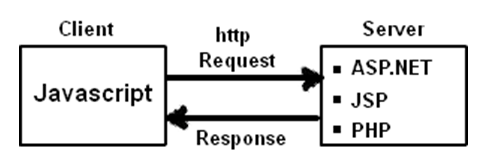
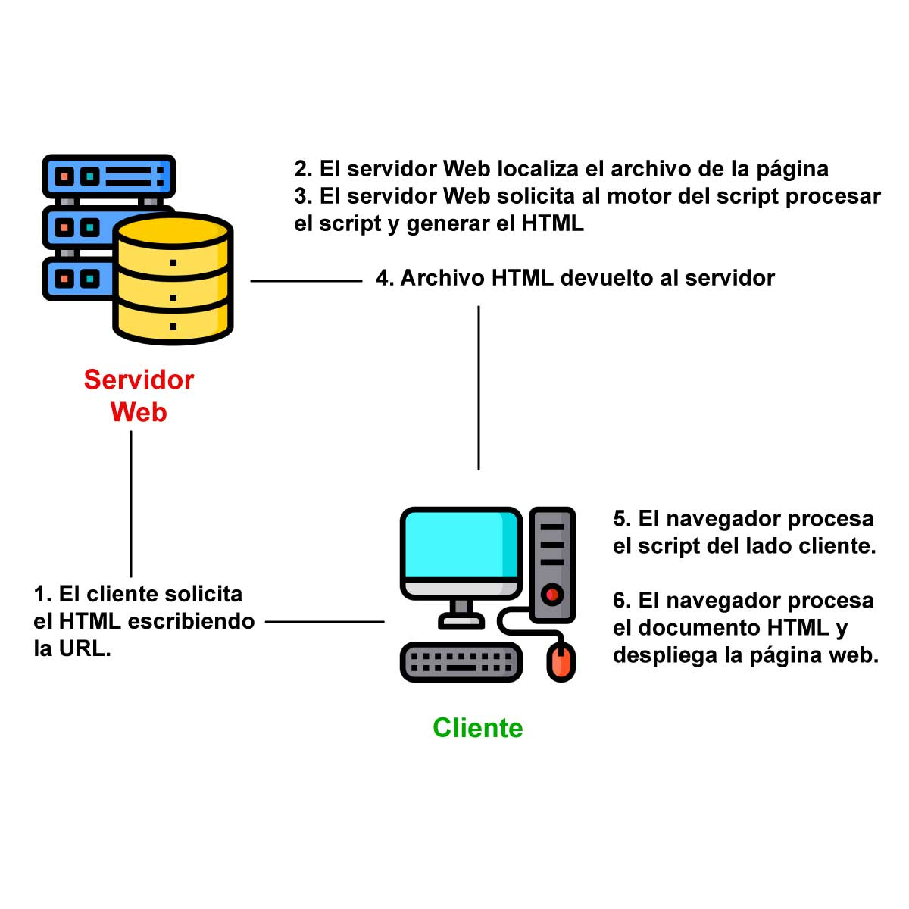
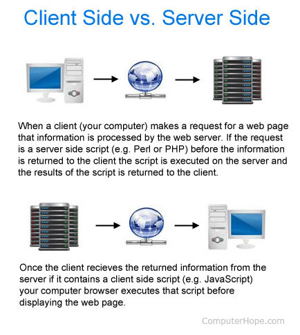

# Lenguajes de programación

## Introducción

Para partir de un breve resumen de la historia de la computación, nos remontamos a los años 30, cuando se construyeron las primeras máquinas capaces de realizar ciertas operaciones, si bien normalmente estaban orientadas a realizar algún tipo concreto de cálculo científico. Existe cierto acuerdo en que el **ENIAC** (1946) puede considerarse el primer computador realmente de **propósito general**. El ENIAC no se programaba utilizando un lenguaje de programación, sino cableando directamente sus circuitos.

### Máquina Turing
La máquina de Turing es un dispositivo que manipula símbolos sobre una tira de cinta de acuerdo con una tabla de reglas.

La importancia de la máquina de Turing en la historia de la computación es doble: primero, la máquina de Turing fue uno de los primeros (si no el primero) modelos teóricos para las computadoras, viendo la luz en 1936. Segundo, estudiando sus propiedades abstractas, la máquina de Turing ha servido de base para mucho desarrollo teórico en las ciencias de la computación .

Las primeras máquinas de computación tenían programas fijos. Algunos equipos muy simples siguen utilizando este diseño, ya sea por motivos de simplificación o de formación. Por ejemplo, una calculadora de escritorio es (en principio) una computadora de programa fijo. En ella, se pueden hacer matemáticas básicas, pero no puede ser utilizada como procesador de texto o consola de juegos. Cambiar el programa de una máquina de programa fijo requiere recablear, reestructurar, o rediseñar la máquina. Las primeras computadoras no eran tanto "programadas" ya que fueron "diseñadas". "Reprogramar" cuando era posible, era un proceso laborioso que comenzaba con diagramas de flujo y notas de papel, seguido de diseños detallados de ingeniería y luego el muchas veces arduo proceso de recablear físicamente y reconstruir la máquina. Podía tomar hasta tres semanas preparar un programa de ENIAC y conseguir que funcionara.
 -- <cite>[Wikipedia](https://es.wikipedia.org/wiki/Arquitectura_de_Von_Neumann#cite_ref-4)</cite>
### Arquitectura Von Neuman
Por esa época, **John Von Neumann** propuso una **[arquitectura](https://es.wikipedia.org/wiki/Arquitectura_de_Von_Neumann)** diferente para las computadoras, donde **el programa se almacena en un área de memoria** de la máquina antes de **ejecutarse secuencialmente por la unidad de procesamiento (CPU)**. Esto permitió, a partir de entonces, evitar tener que cablear todos los componentes para cada nuevo problema. Es entonces donde empieza la historia de los lenguajes de programación.

Bajo arquitectura de von Neumann pura, la CPU puede estar bien leyendo una instrucción o escribiendo datos en memoria pero ambos procesos **no pueden ocurrir al mismo tiempo**, ya que las instrucciones y datos usan el mismo sistema de buses. 

### Arquitectura Harvard
La arquitectura de Harvard es una arquitectura de computadora con pistas de almacenamiento y de señal físicamente separadas para las instrucciones y para los datos.En una computadora que utiliza la **arquitectura Harvard**, la CPU puede tanto leer una instrucción como realizar un acceso a la memoria de datos al mismo tiempo.En consecuencia, una arquitectura de computadores Harvard puede ser más rápida para un circuito complejo, debido a que la instrucción obtiene acceso a datos y no compite por una única vía de memoria.

### Programa almacenado
A diferencia de los primeros computadores, von Neumann proponía que tanto el programa como sus datos fueran almacenados en la memoria del computador.Esto no solo simplificaba la labor de programación al no tener que llevar a cabo el recableado del computador sino que además libraba y generalizaba el diseño del hardware para hacerlo independiente de cualquier problema y enfocado al control y ejecución del programa. Este concepto fue tan importante y decisivo que dio lugar al concepto de la arquitectura de von Neumann, aún presente en nuestros días.

### ¿Qué es un lenguaje de programación?
Un lenguaje de programación es una notación especial para comunicarse con el ordenador: un conjunto de símbolos con una sintaxis y una semántica que permite definir instrucciones interpretables por una CPU (directamente o mediante traducción).

Para la implementación de los programas, los lenguajes de programación nos proporcionan:

- Estructuras de datos para el almacenamiento de la información a procesar.
- Instrucciones y operadores para el procesado de dicha información.

## Clasificación histórica y basada en el nivel de abstracción

Se agrupan ambas clasificaciones ya que la segunda es concurrente a las primeras etapas de la primera. El nivel de abstracción es la proximidad al lenguaje natural (con el que nos comunicamos los humanos).

### Bajo nivel

Se utiliza el término bajo nivel para aquellos lenguajes que proporcionan poca o ninguna abstracción con respecto al **conjunto de instrucciones de la CPU**.

#### Primera generación: lenguaje máquina

Los programas para los primeros ordenadores programados se escribían directamente en binario, que es la transcripción lógica de las señales eléctricas con las que trabaja directamente un ordenador. Cada procesador, según ha sido diseñado, dispone de un **conjunto de instrucciones** que son las operaciones que entiende (sumar, restar, cargar en memoria, guardar en memoria, etc.). **Los programas escritos en código máquina solo funcionan en ordenadores que comparten el mismo conjunto de instrucciones**.

#### Segunda generación: lenguaje ensamblador

Los lenguajes ensambladores consisten simplemente en establecer una serie de reglas mnemotécnicas asociadas a las instrucciones soportadas por la máquina (ADD, SUB, LOAD, STORE, etc.) que hacen más sencilla la lectura y escritura de programas. La traducción a lenguaje máquina es directa y sencilla. Estos lenguajes todavía se utilizan hoy en día para programar ***drivers*** para dispositivos o determinadas partes de los sistemas operativos.
Este lenguaje sí permite los **comentarios** y las instrucciones añaden etiquetas para establecer puntos de acceso por control de flujo condicional o repetitivo.

[Más información y ejemplos en wikipedia](https://es.wikipedia.org/wiki/Lenguaje_ensamblador#Ejemplos)

### Tercera generación: **lenguajes de alto nivel**

En los años 50 se empezó a trabajar en el desarrollo de lenguajes capaces de expresar las distintas acciones que quería realizar el programador de manera lo más sencilla posible. Se presentó entonces **FORTRAN**, un lenguaje que permitía escribir fórmulas matemáticas de manera traducible para un ordenador. Representó así el primer lenguaje **de alto nivel de propósito general** y supuso el inicio de los lenguajes de tercera generación.

Los lenguajes de alto nivel permiten hacer programas más portables, ya que, en ensamblador, cada programa tiene que rehacerse para el conjunto de instrucciones específico de cada procesador.
La carga de trabajo de hacer multiples versiones se va relegando, con el paso del tiempo cada vez más a los programadores de los traductores.
Además, para programar en lenguaje ensamblador es necesario un profundo conocimiento de la máquina en la que se va a ejecutar, ya que debemos conocer detalles como la gestión de memoria, comunicación con periféricos, sistemas operativos, servicios provistos por la BIOS y por el propio sistema operativo entre otros.

Los primeros son:

- Compilados e imperativos: **Fortran**, **Algol** y **Cobol**.
- **Lisp** (primer lenguaje de alto nivel interpretado y primero funcional).

En esta generación incluiríamos lenguajes de uso común hasta la actualidad (o incluso de reciente creación) como **C, C++, Java o Go**. Estos lenguajes se denominan de **alto nivel (de abstracción)** por estar bastante alejados del lenguaje máquina y más cerca del lenguaje natural.

Dentro de lo que aquí se ha categorizado como lenguajes de alto nivel existen algunos, como **C** (1972), que a en la actualizad son llamados lenguajes de **medio nivel** (o incluso bajo) por ofrecer un acceso muy directo al nivel de máquina (como el direccionamiento de posiciones de memoria), que se distancian así de otros de “más alto nivel” como **C#** o **Java**.

Podríamos decir que dentro de los lenguajes de alto nivel, también hay lenguajes que se encuentran a distintos niveles de abstracción.

### Cuarta generación

Se consideran lenguajes de cuarta generación a [**lenguajes de propósito específico (DSLs)**](#clasificación-por-ámbito), como **SQL**, NATURAL o SPSS. Estos lenguajes no están diseñados para programar aplicaciones complejas, sino que fueron diseñados para solucionar problemas muy concretos. Por ejemplo, SQL es el lenguaje empleado para describir consultas, inserciones o modificaciones de bases de datos.

### Quinta generación

Se llamaron lenguajes de quinta generación a algunos utilizados en **inteligencia artificial**. Se trata de lenguajes que permiten especificar restricciones que se le indican al sistema y resuelve un determinado problema sujeto a estas restricciones (**Constraint Programming**). Algunos ejemplos serían **Prolog** o Mercury.

## Clasificación por ámbito

Un lenguaje específico de dominio, lenguaje de propósito específico o **DSL (domain-specific language)** es un lenguaje diseñado específicamente para realizar un tipo de tareas y facilitarlas. El concepto contrario es el de lenguaje de propósito general o **GPL (general-purpose language)**. Algunos ejemplos de DSL son:

- SPSS o **R** para análisis de datos
- **SQL** para consultas de bases de datos relacionales

Un DSL es un lenguaje de programación con un **nivel superior de abstracción** optimizado para una clase específica de problemas. Es por ello normalmente menos complejo en su uso que un lenguaje de propósito general. En muchos casos, los DSL están destinados no para ser usados por expertos en software, sino por no programadores que son versados en el dominio de aplicación del DSL.  -- <cite>[jetbrains.com](https://www.jetbrains.com/es-es/mps/concepts/domain-specific-languages/)</cite>

## Clasificación en la arquitectura cliente-servidor

 

El navegador es una especie de aplicación capaz de interpretar las órdenes recibidas en forma de código HTML fundamentalmente y convertirlas en las páginas que son el resultado de dicha orden.
Cuando nosotros pinchamos sobre un enlace hipertexto, en realidad lo que pasa es que establecemos una petición de un archivo HTML residente en el servidor (un ordenador que se encuentra continuamente conectado a la red) el cual es enviado e interpretado por nuestro navegador (el cliente). Así pues, podemos hablar de lenguajes de lado servidor que son aquellos lenguajes que son reconocidos, ejecutados e interpretados por el propio servidor y que se envían al cliente en un formato comprensible para él. Por otro lado, los lenguajes de lado cliente (entre los cuales no sólo se encuentra el HTML sino también el Java y el JavaScript los cuales son simplemente incluidos en el código HTML) son aquellos que pueden ser directamente "digeridos" por el navegador y no necesitan un pretratamiento.

### Cliente
Son aquellos que se ejecutan en el navegador del usuario y son responsables de la interfaz de usuario y la interactividad de una aplicación web, son la opción más segura y por la que optan la mayoría de programadores pero presenta una serie de límites de control y problemas con los navegadores web. 

Los lenguajes del lado cliente más utilizados son: Visual Basic Script y JavaScript.

Además, del lado cliente hay algunas bibliotecas y frameworks que están hechos a partir de lenguajes básicos y nos proporcionan herramientas y funcionalidades adicionaes para facilitar el desarrollo de aplicaciones web.

### Servidor

La programacion del lado servidor se ejecuta en el propio servidor de forma que se reducen los errores a raiz de la compatibilidad, son responsables de procesar las solicitudes del cliente.

Los lenguajes del lado servidor más utilizados son: ASP, PERL y PHP.

